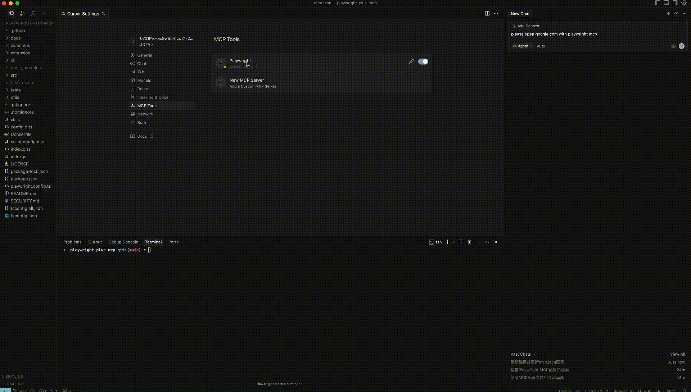
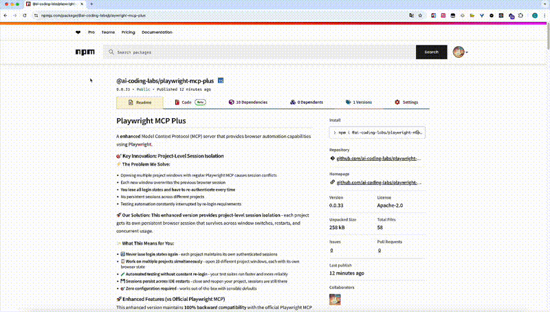

<div align="center">

# Playwright MCP Plus

**🌐 Language / 语言:** [English](README.md) | [中文](README.zh.md)

</div>

---

### 🎭 看看区别！

#### 😫 没有 Playwright Plus MCP
> **单浏览器限制：** 一次只能运行一个浏览器自动化会话。会话冲突会破坏你的工作流程...

**📹 演示视频：**

[](https://github.com/ai-coding-labs/playwright-plus-mcp/raw/main/docs/images/before-use-playwright-plus-mcp.mp4)

#### 🚀 使用 Playwright Plus MCP
> **🎯 游戏规则改变者：同时打开多个浏览器进行并发自动化测试！**
>
> 体验**并行浏览器自动化**的强大力量 - 同时在不同项目中运行多个自动化测试，每个都有自己的持久会话！

**📹 演示视频：**

[](https://github.com/ai-coding-labs/playwright-plus-mcp/raw/main/docs/images/after-use-playwright-plus-mcp.mp4)

> **💡 注意：** 这些视频展示了革命性的差异 - 从单浏览器限制到**无限并发浏览器自动化**。

**🔥 你刚刚见证的：**
- 😫 **修复前：** 只能一个浏览器。打开新项目 = 会话被销毁。每次都要手动重新登录。
- 🚀 **修复后：** **无限并发浏览器！** 同时打开 5、10、20+ 个浏览器自动化会话。每个项目都保持自己的持久状态。**真正的大规模并行自动化测试！**

## Playwright MCP Plus

一个**增强版**的模型上下文协议（MCP）服务器，使用 [Playwright](https://playwright.dev) 提供浏览器自动化功能。

### 🎯 **核心创新：项目级会话隔离**

**⚡ 我们解决的问题：**
- **单浏览器瓶颈：** 常规 Playwright MCP = 一次只能运行一个浏览器自动化会话
- 打开多个项目窗口会导致灾难性的会话冲突
- 每个新的自动化任务都会**销毁之前的浏览器会话**
- **自动化测试在规模化时变得不可能** - 你无法运行并行测试
- 持续的重新认证会扼杀生产力并破坏 CI/CD 工作流程

**🚀 我们的革命性解决方案：**
**🎯 无限并发浏览器自动化** - 在不同项目中同时运行多个自动化测试，每个都有隔离的持久会话！

**✨ 这为你解锁了什么：**
- 🚀 **并发自动化测试** - 同时运行 10+ 个浏览器自动化会话而不冲突
- 🔄 **再也不会丢失登录状态** - 每个项目都维护自己的认证会话
- 🪟 **并行项目工作流** - 同时在多个项目中自动化测试
- 🧪 **可扩展的测试自动化** - 你的测试套件并行运行，更快更可靠
- 💾 **会话在 IDE 重启后持久保存** - 关闭并重新打开项目，所有会话仍然完好
- 🎯 **零配置要求** - 开箱即用，具有智能默认设置

### 🚀 增强功能（相比官方 Playwright MCP）

这个增强版本保持与官方 Playwright MCP **100% 向后兼容**，同时解锁**无限并发浏览器自动化**：

#### **🎯 并发自动化测试**
- **🚀 无限并行浏览器**：同时运行多个浏览器自动化会话而不冲突
- **⚡ 可扩展测试自动化**：在多个项目中并发执行自动化测试
- **🔄 零会话干扰**：每个浏览器会话完全与其他会话隔离

#### **🔒 项目会话隔离**
- **🏗️ 自动项目检测**：每个项目都有自己的隔离浏览器会话
- **💾 持久登录状态**：在 IDE 重启和窗口切换时保持登录状态
- **🚪 不再重新认证**：你的自动化测试和工作流程不间断运行
- **📁 清洁项目目录**：默认情况下项目文件夹中没有会话文件
- **🌍 跨平台支持**：为 Windows、macOS、Linux 智能选择存储位置

#### **🛠️ 多种存储策略**
- `system`：存储在操作系统缓存目录（推荐，用户不可见）
- `project`：存储在项目目录（传统行为）
- `custom`：存储在自定义位置

#### **⚙️ 配置参数**
- `--project-isolation`：启用项目级会话隔离（默认：禁用）
- `--project-isolation-session-strategy`：选择存储策略（默认："system"）
- `--project-isolation-session-root-dir`：会话存储的自定义根目录

#### **✅ 相比官方版本的革命性优势**
- 🚀 **无限并发浏览器**：同时运行多个浏览器自动化会话（相比单会话限制）
- ⚡ **并行自动化测试**：同时在多个项目中执行自动化测试
- ✅ **100% 向后兼容**：官方版本的直接替代品
- ✅ **多项目工作流**：在多个项目上工作而不会话冲突
- ✅ **持久认证**：会话之间永不丢失登录状态
- ✅ **可扩展测试自动化**：消除重新登录开销并启用并行测试执行
- ✅ **清洁工作空间**：默认情况下项目目录中没有会话文件
- ✅ **无冲突**：使用官方 Playwright 路径结构避免冲突
- ✅ **零维护**：自动清理和管理会话数据

### 核心功能

- **🚀 并发浏览器自动化**。运行无限并行浏览器会话进行可扩展的自动化测试。
- **快速轻量**。使用 Playwright 的可访问性树，而不是基于像素的输入。
- **LLM 友好**。不需要视觉模型，纯粹基于结构化数据操作。
- **确定性工具应用**。避免基于截图方法常见的歧义。
- **🆕 项目级隔离**。每个项目都有独立的浏览器会话和智能存储管理。

### 要求
- Node.js 18 或更新版本
- VS Code、Cursor、Windsurf、Claude Desktop、Goose 或任何其他 MCP 客户端

### 开始使用

首先，在你的客户端中安装 Playwright MCP 服务器。

**标准配置**（与官方 Playwright MCP 100% 兼容）：

```js
{
  "mcpServers": {
    "playwright-plus": {
      "command": "npx",
      "args": [
        "-y",
        "@ai-coding-labs/playwright-mcp-plus@latest"
      ]
    }
  }
}
```

**增强配置**，带项目隔离（推荐）：

```js
{
  "mcpServers": {
    "playwright-plus": {
      "command": "npx",
      "args": [
        "-y",
        "@ai-coding-labs/playwright-mcp-plus@latest",
        "--project-isolation"
      ]
    }
  }
}
```

**高级配置**，带自定义会话存储：

```js
{
  "mcpServers": {
    "playwright-plus": {
      "command": "npx",
      "args": [
        "-y",
        "@ai-coding-labs/playwright-mcp-plus@latest",
        "--project-isolation",
        "--project-isolation-session-strategy=custom",
        "--project-isolation-session-root-dir=/custom/session/path"
      ]
    }
  }
}
```

**💡 多项目工作流专业提示：**

一旦启用 `--project-isolation`，你的每个项目都会自动获得自己的浏览器会话。当你调用任何浏览器工具时，只需包含项目参数：

```javascript
// 每个项目自动获得隔离的会话
browser_navigate({
  url: "https://yourapp.com",
  projectDrive: "/",                    // macOS/Linux: "/"，Windows: "C:"
  projectPath: "/path/to/your/project"  // 项目目录的绝对路径
})
```

这确保你的登录状态、cookies 和浏览器数据在不同项目之间永不干扰！

### 🎬 真实世界使用场景

**修复前（官方 Playwright MCP）：**
```bash
# 在项目 A 上工作 - 登录管理面板
browser_navigate("https://myapp-staging.com/admin")
# 用凭据登录，做一些测试...

# 切换到项目 B 窗口 - 会话丢失！😱
browser_navigate("https://different-app.com/dashboard")
# 项目 A 的所有登录状态都消失了，必须重新登录

# 切换回项目 A - 登录又丢失了！😱
# 每次都必须重新认证
```

**修复后（带项目隔离）：**
```bash
# 项目 A - 登录一次，永远保持登录
browser_navigate({
  url: "https://myapp-staging.com/admin",
  projectDrive: "/",
  projectPath: "/Users/you/projects/project-a"
})

# 项目 B - 完全独立的会话
browser_navigate({
  url: "https://different-app.com/dashboard",
  projectDrive: "/",
  projectPath: "/Users/you/projects/project-b"
})

# 切换回项目 A - 仍然登录！✨
# 无需重新认证，会话完美保存
```

**结果：** 你的自动化测试运行速度提高 10 倍，开发工作流程不被中断，你可以同时在多个项目上工作而不会丢失认证状态。

[](https://insiders.vscode.dev/redirect?url=vscode%3Amcp%2Finstall%3F%257B%2522name%2522%253A%2522playwright%2522%252C%2522command%2522%253A%2522npx%2522%252C%2522args%2522%253A%255B%2522%2540playwright%252Fmcp%2540latest%2522%255D%257D) [](https://insiders.vscode.dev/redirect?url=vscode-insiders%3Amcp%2Finstall%3F%257B%2522name%2522%253A%2522playwright%2522%252C%2522command%2522%253A%2522npx%2522%252C%2522args%2522%253A%255B%2522%2540playwright%252Fmcp%2540latest%2522%255D%257D)

<details>
<summary>Claude Code</summary>

使用 Claude Code CLI 添加增强版 Playwright MCP 服务器：

**标准版本：**
```bash
claude mcp add playwright-plus npx -y @ai-coding-labs/playwright-mcp-plus@latest
```

**带项目隔离（推荐）：**
```bash
claude mcp add playwright-plus npx -y @ai-coding-labs/playwright-mcp-plus@latest --project-isolation
```
</details>

<details>
<summary>Claude Desktop</summary>

按照 MCP 安装[指南](https://modelcontextprotocol.io/quickstart/user)，使用上面的标准配置。

</details>

<details>
<summary>Cursor</summary>

#### 点击按钮安装：

[](https://cursor.com/install-mcp?name=playwright-plus&config=eyJjb21tYW5kIjoibnB4IEBwbGF5d3JpZ2h0L21jcEBsYXRlc3QifQ%3D%3D)

#### 或手动安装：

转到 `Cursor Settings` -> `MCP` -> `Add new MCP Server`。随意命名，使用 `command` 类型，命令为 `npx -y @ai-coding-labs/playwright-mcp-plus --project-isolation`。你也可以通过点击 `Edit` 验证配置或添加命令参数。

</details>

<details>
<summary>Gemini CLI</summary>

按照 MCP 安装[指南](https://github.com/google-gemini/gemini-cli/blob/main/docs/tools/mcp-server.md#configure-the-mcp-server-in-settingsjson)，使用上面的标准配置。

</details>

<details>
<summary>Goose</summary>

#### 点击按钮安装：

[](https://block.github.io/goose/extension?cmd=npx&arg=%40playwright%2Fmcp%40latest&id=playwright-plus&name=Playwright&description=Interact%20with%20web%20pages%20through%20structured%20accessibility%20snapshots%20using%20Playwright)

#### 或手动安装：

转到 `Advanced settings` -> `Extensions` -> `Add custom extension`。随意命名，使用类型 `STDIO`，将 `command` 设置为 `npx -y @ai-coding-labs/playwright-mcp-plus --project-isolation`。点击 "Add Extension"。
</details>

<details>
<summary>LM Studio</summary>

#### 点击按钮安装：

[](https://lmstudio.ai/install-mcp?name=playwright-plus&config=eyJjb21tYW5kIjoibnB4IiwiYXJncyI6WyJAcGxheXdyaWdodC9tY3BAbGF0ZXN0Il19)

#### 或手动安装：

转到右侧边栏的 `Program` -> `Install` -> `Edit mcp.json`。使用上面的标准配置。
</details>

<details>
<summary>Qodo Gen</summary>

在 VSCode 或 IntelliJ 中打开 [Qodo Gen](https://docs.qodo.ai/qodo-documentation/qodo-gen) 聊天面板 → Connect more tools → + Add new MCP → 粘贴上面的标准配置。

点击 <code>Save</code>。
</details>

<details>
<summary>VS Code</summary>

#### 点击按钮安装：

[](https://insiders.vscode.dev/redirect?url=vscode%3Amcp%2Finstall%3F%257B%2522name%2522%253A%2522playwright%2522%252C%2522command%2522%253A%2522npx%2522%252C%2522args%2522%253A%255B%2522%2540playwright%252Fmcp%2540latest%2522%255D%257D) [](https://insiders.vscode.dev/redirect?url=vscode-insiders%3Amcp%2Finstall%3F%257B%2522name%2522%253A%2522playwright%2522%252C%2522command%2522%253A%2522npx%2522%252C%2522args%2522%253A%255B%2522%2540playwright%252Fmcp%2540latest%2522%255D%257D)

#### 或手动安装：

按照 MCP 安装[指南](https://code.visualstudio.com/docs/copilot/chat/mcp-servers#_add-an-mcp-server)，使用上面的标准配置。你也可以使用 VS Code CLI 安装 Playwright MCP 服务器：

```bash
# 对于 VS Code
code --add-mcp '{"name":"playwright-plus","command":"npx","args":["-y","@ai-coding-labs/playwright-mcp-plus@latest","--project-isolation"]}'
```

安装后，Playwright MCP 服务器将可用于 VS Code 中的 GitHub Copilot 代理。
</details>

<details>
<summary>Windsurf</summary>

按照 Windsurf MCP [文档](https://docs.windsurf.com/windsurf/cascade/mcp)。使用上面的标准配置。

</details>

### 配置

Playwright MCP 服务器支持以下参数。它们可以在上面的 JSON 配置中作为 `"args"` 列表的一部分提供：

<!--- 由 update-readme.js 生成的选项 -->

```
> npx @ai-coding-labs/playwright-mcp-plus@latest --help
  --allowed-origins <origins>                      允许浏览器请求的源的分号分隔列表。默认允许所有。
  --blocked-origins <origins>                      阻止浏览器请求的源的分号分隔列表。阻止列表在允许列表之前评估。如果在没有允许列表的情况下使用，不匹配阻止列表的请求仍然被允许。
  --block-service-workers                          阻止 service workers
  --browser <browser>                              要使用的浏览器或 chrome 频道，可能的值：chrome、firefox、webkit、msedge。
  --caps <caps>                                    要启用的附加功能的逗号分隔列表，可能的值：vision、pdf。
  --cdp-endpoint <endpoint>                        要连接的 CDP 端点。
  --config <path>                                  配置文件的路径。
  --device <device>                                要模拟的设备，例如："iPhone 15"
  --executable-path <path>                         浏览器可执行文件的路径。
  --headless                                       在无头模式下运行浏览器，默认有头
  --host <host>                                    绑定服务器的主机。默认是 localhost。使用 0.0.0.0 绑定到所有接口。
  --ignore-https-errors                            忽略 https 错误
  --isolated                                       将浏览器配置文件保存在内存中，不保存到磁盘。
  --image-responses <mode>                         是否向客户端发送图像响应。可以是 "allow" 或 "omit"，默认为 "allow"。
  --no-sandbox                                     为通常沙盒化的所有进程类型禁用沙盒。
  --output-dir <path>                              输出文件目录的路径。
  --port <port>                                    SSE 传输监听的端口。
  --project-isolation                              使用来自 MCP 上下文的项目路径启用项目级会话隔离。
  --project-isolation-session-strategy <strategy>  项目隔离的会话目录策略：system、project、custom。默认为 "system"。(default: "system")
  --project-isolation-session-root-dir <path>      使用项目隔离时会话存储的自定义根目录（仅在 --project-isolation-session-strategy=custom 时使用）。
  --proxy-bypass <bypass>                          绕过代理的逗号分隔域，例如 ".com,chromium.org,.domain.com"
  --proxy-server <proxy>                           指定代理服务器，例如 "http://myproxy:3128" 或 "socks5://myproxy:8080"
  --save-session                                   是否将 Playwright MCP 会话保存到输出目录。
  --save-trace                                     是否将会话的 Playwright Trace 保存到输出目录。
  --storage-state <path>                           隔离会话的存储状态文件路径。
  --user-agent <ua string>                         指定用户代理字符串
  --user-data-dir <path>                           用户数据目录的路径。如果未指定，将创建临时目录。
  --viewport-size <size>                           指定浏览器视口大小（像素），例如 "1280, 720"
```

<!--- 选项生成部分结束 -->

### 用户配置文件

你可以像常规浏览器一样使用持久配置文件运行 Playwright MCP（默认），或在隔离上下文中进行测试会话。

**持久配置文件**

所有登录信息都将存储在持久配置文件中，如果你想清除离线状态，可以在会话之间删除它。
持久配置文件位于以下位置，你可以使用 `--user-data-dir` 参数覆盖它。

```bash
# Windows
%USERPROFILE%\AppData\Local\ms-playwright\mcp-{channel}-profile

# macOS
- ~/Library/Caches/ms-playwright/mcp-{channel}-profile

# Linux
- ~/.cache/ms-playwright/mcp-{channel}-profile
```

**隔离**

在隔离模式下，每个会话都在隔离配置文件中启动。每次你要求 MCP 关闭浏览器时，
会话都会关闭，此会话的所有存储状态都会丢失。你可以通过配置的 `contextOptions` 或通过 `--storage-state` 参数向浏览器提供初始存储状态。在[这里](https://playwright.dev/docs/auth)了解更多关于存储状态的信息。

```js
{
  "mcpServers": {
    "playwright-plus": {
      "command": "npx",
      "args": [
        "@ai-coding-labs/playwright-mcp-plus@latest",
        "--isolated",
        "--storage-state={path/to/storage.json}"
      ]
    }
  }
}
```

### 🔒 项目隔离（增强功能）

**项目隔离**允许每个项目维护自己独立的浏览器会话，具有独立的登录状态、cookies 和 localStorage。这可以防止跨项目干扰，同时保持工作空间清洁。

#### **默认行为（向后兼容）**
没有任何隔离标志时，会话在所有项目之间共享（与官方 Playwright MCP 相同）：

```js
{
  "mcpServers": {
    "playwright-plus": {
      "command": "npx",
      "args": ["@ai-coding-labs/playwright-mcp-plus@latest"]
    }
  }
}
```

#### **推荐：系统策略（零配置）**
启用项目隔离，会话存储在操作系统缓存目录中（对用户不可见）：

```js
{
  "mcpServers": {
    "playwright-plus": {
      "command": "npx",
      "args": [
        "@ai-coding-labs/playwright-mcp-plus@latest",
        "--project-isolation"
      ]
    }
  }
}
```

**按操作系统的存储位置：**
- **Windows:** `%LOCALAPPDATA%/ms-playwright/mcp-chrome-profile/playwright-plus-mcp/project-hash/`
- **macOS:** `~/Library/Caches/ms-playwright/mcp-chrome-profile/playwright-plus-mcp/project-hash/`
- **Linux:** `~/.cache/ms-playwright/mcp-chrome-profile/playwright-plus-mcp/project-hash/`

#### **项目策略**
在项目目录中存储会话（创建 `.user-session-data-directory/`）：

```js
{
  "mcpServers": {
    "playwright-plus": {
      "command": "npx",
      "args": [
        "@ai-coding-labs/playwright-mcp-plus@latest",
        "--project-isolation",
        "--project-isolation-session-strategy=project"
      ]
    }
  }
}
```

#### **自定义策略**
在自定义位置存储会话：

```js
{
  "mcpServers": {
    "playwright-plus": {
      "command": "npx",
      "args": [
        "@ai-coding-labs/playwright-mcp-plus@latest",
        "--project-isolation",
        "--project-isolation-session-strategy=custom",
        "--project-isolation-session-root-dir=/custom/sessions"
      ]
    }
  }
}
```

#### **策略比较**

| 配置 | 会话位置 | 项目目录 | 用户可见性 | 使用场景 |
|------|----------|----------|------------|----------|
| **无隔离**（默认） | 共享缓存 | 清洁 | 隐藏 | 向后兼容 |
| **系统**（隔离默认） | 操作系统缓存目录 | 清洁 | 隐藏 | 最佳用户体验 |
| **项目** | `.user-session-data-directory/` | 有会话文件 | 可见 | 传统/调试 |
| **自定义** | 自定义路径 | 清洁 | 隐藏 | 高级设置 |

### 配置文件

Playwright MCP 服务器可以使用 JSON 配置文件进行配置。你可以使用 `--config` 命令行选项指定配置文件：

```bash
npx @ai-coding-labs/playwright-mcp-plus@latest --config path/to/config.json
```

<details>
<summary>配置文件架构</summary>

```typescript
{
  // 浏览器配置
  browser?: {
    // 要使用的浏览器类型（chromium、firefox 或 webkit）
    browserName?: 'chromium' | 'firefox' | 'webkit';

    // 将浏览器配置文件保存在内存中，不保存到磁盘。
    isolated?: boolean;

    // 浏览器配置文件持久化的用户数据目录路径
    userDataDir?: string;

    // 浏览器启动选项（参见 Playwright 文档）
    // @see https://playwright.dev/docs/api/class-browsertype#browser-type-launch
    launchOptions?: {
      channel?: string;        // 浏览器频道（例如 'chrome'）
      headless?: boolean;      // 在无头模式下运行
      executablePath?: string; // 浏览器可执行文件路径
      // ... 其他 Playwright 启动选项
    };

    // 浏览器上下文选项
    // @see https://playwright.dev/docs/api/class-browser#browser-new-context
    contextOptions?: {
      viewport?: { width: number, height: number };
      // ... 其他 Playwright 上下文选项
    };

    // 用于连接到现有浏览器的 CDP 端点
    cdpEndpoint?: string;

    // 远程 Playwright 服务器端点
    remoteEndpoint?: string;
  },

  // 服务器配置
  server?: {
    port?: number;  // 监听端口
    host?: string;  // 绑定主机（默认：localhost）
  },

  // 附加功能列表
  capabilities?: Array<
    'tabs' |    // 标签管理
    'install' | // 浏览器安装
    'pdf' |     // PDF 生成
    'vision' |  // 基于坐标的交互
  >;

  // 输出文件目录
  outputDir?: string;

  // 网络配置
  network?: {
    // 允许浏览器请求的源列表。默认允许所有。同时匹配 `allowedOrigins` 和 `blockedOrigins` 的源将被阻止。
    allowedOrigins?: string[];

    // 阻止浏览器请求的源列表。同时匹配 `allowedOrigins` 和 `blockedOrigins` 的源将被阻止。
    blockedOrigins?: string[];
  };

  /**
   * 是否向客户端发送图像响应。可以是 "allow" 或 "omit"。
   * 默认为 "allow"。
   */
  imageResponses?: 'allow' | 'omit';

  /**
   * 使用来自 MCP 上下文的项目路径启用项目级会话隔离。
   * 启用时，每个项目都有自己的隔离浏览器会话。
   * 默认为 false（共享会话，与官方 Playwright MCP 兼容）。
   */
  projectIsolation?: boolean;

  /**
   * 项目隔离的会话目录存储策略。
   * 仅在启用 projectIsolation 时使用。
   * - 'system'：存储在操作系统缓存目录（推荐，用户不可见）
   * - 'project'：存储在项目目录（传统行为）
   * - 'custom'：存储在 projectIsolationSessionRootDir 指定的自定义位置
   * 默认为 "system"。
   */
  projectIsolationSessionStrategy?: 'system' | 'project' | 'custom';

  /**
   * 使用项目隔离时会话存储的自定义根目录。
   * 仅在 projectIsolationSessionStrategy 为 'custom' 时使用。
   * 示例："/custom/session/storage/path"
   */
  projectIsolationSessionRootDir?: string;
}
```
</details>

### 独立 MCP 服务器

在没有显示器的系统上运行有头浏览器或从 IDE 的工作进程运行时，
从具有 DISPLAY 的环境运行 MCP 服务器并传递 `--port` 标志以启用 HTTP 传输。

```bash
npx @ai-coding-labs/playwright-mcp-plus@latest --port 8931
```

然后在 MCP 客户端配置中，将 `url` 设置为 HTTP 端点：

```js
{
  "mcpServers": {
    "playwright-plus": {
      "url": "http://localhost:8931/mcp"
    }
  }
}
```

<details>
<summary><b>Docker</b></summary>

**注意：** Docker 实现目前仅支持无头 chromium。

```js
{
  "mcpServers": {
    "playwright-plus": {
      "command": "docker",
      "args": ["run", "-i", "--rm", "--init", "--pull=always", "mcr.microsoft.com/playwright/mcp"]
    }
  }
}
```

你可以自己构建 Docker 镜像。

```
docker build -t mcr.microsoft.com/playwright/mcp .
```
</details>

<details>
<summary><b>编程使用</b></summary>

```js
import http from 'http';

import { createConnection } from '@ai-coding-labs/playwright-mcp-plus';
import { SSEServerTransport } from '@modelcontextprotocol/sdk/server/sse.js';

http.createServer(async (req, res) => {
  // ...

  // 创建带有 SSE 传输的无头 Playwright MCP 服务器
  const connection = await createConnection({ browser: { launchOptions: { headless: true } } });
  const transport = new SSEServerTransport('/messages', res);
  await connection.sever.connect(transport);

  // ...
});
```
</details>

### 工具

<!--- 由 update-readme.js 生成的工具 -->

<details>
<summary><b>核心自动化</b></summary>

<!-- 注意：这是通过 update-readme.js 生成的 -->

- **browser_click**
  - 标题：点击
  - 描述：在网页上执行点击操作
  - 参数：
    - `element` (string)：用于获得与元素交互权限的人类可读元素描述
    - `ref` (string)：来自页面快照的确切目标元素引用
    - `doubleClick` (boolean, 可选)：是否执行双击而不是单击
    - `button` (string, 可选)：要点击的按钮，默认为左键
  - 只读：**false**

<!-- 注意：这是通过 update-readme.js 生成的 -->

- **browser_close**
  - 标题：关闭浏览器
  - 描述：关闭页面
  - 参数：
    - `projectDrive` (string, 可选)：用于会话隔离的项目驱动器字母或根目录（例如，"C:"，"/"）
    - `projectPath` (string, 可选)：用于会话隔离的项目根目录的绝对路径
  - 只读：**true**

<!-- 注意：这是通过 update-readme.js 生成的 -->

- **browser_console_messages**
  - 标题：获取控制台消息
  - 描述：返回所有控制台消息
  - 参数：无
  - 只读：**true**

<!-- 注意：这是通过 update-readme.js 生成的 -->

- **browser_drag**
  - 标题：拖拽鼠标
  - 描述：在两个元素之间执行拖放操作
  - 参数：
    - `startElement` (string)：用于获得与元素交互权限的人类可读源元素描述
    - `startRef` (string)：来自页面快照的确切源元素引用
    - `endElement` (string)：用于获得与元素交互权限的人类可读目标元素描述
    - `endRef` (string)：来自页面快照的确切目标元素引用
  - 只读：**false**

<!-- 注意：这是通过 update-readme.js 生成的 -->

- **browser_evaluate**
  - 标题：执行 JavaScript
  - 描述：在页面或元素上执行 JavaScript 表达式
  - 参数：
    - `function` (string)：() => { /* 代码 */ } 或当提供元素时 (element) => { /* 代码 */ }
    - `element` (string, 可选)：用于获得与元素交互权限的人类可读元素描述
    - `ref` (string, 可选)：来自页面快照的确切目标元素引用
  - 只读：**false**

<!-- 注意：这是通过 update-readme.js 生成的 -->

- **browser_file_upload**
  - 标题：上传文件
  - 描述：上传一个或多个文件
  - 参数：
    - `paths` (array)：要上传的文件的绝对路径。可以是单个文件或多个文件。
  - 只读：**false**

<!-- 注意：这是通过 update-readme.js 生成的 -->

- **browser_handle_dialog**
  - 标题：处理对话框
  - 描述：处理对话框
  - 参数：
    - `accept` (boolean)：是否接受对话框。
    - `promptText` (string, 可选)：在提示对话框情况下的提示文本。
  - 只读：**false**

<!-- 注意：这是通过 update-readme.js 生成的 -->

- **browser_hover**
  - 标题：悬停鼠标
  - 描述：在页面上悬停在元素上
  - 参数：
    - `element` (string)：用于获得与元素交互权限的人类可读元素描述
    - `ref` (string)：来自页面快照的确切目标元素引用
  - 只读：**true**

<!-- 注意：这是通过 update-readme.js 生成的 -->

- **browser_navigate**
  - 标题：导航到 URL
  - 描述：导航到 URL
  - 参数：
    - `url` (string)：要导航到的 URL
    - `projectDrive` (string, 可选)：用于会话隔离的项目驱动器字母或根目录（例如，"C:"，"/"）
    - `projectPath` (string, 可选)：用于会话隔离的项目根目录的绝对路径
  - 只读：**false**

<!-- 注意：这是通过 update-readme.js 生成的 -->

- **browser_navigate_back**
  - 标题：后退
  - 描述：返回到上一页
  - 参数：无
  - 只读：**true**

<!-- 注意：这是通过 update-readme.js 生成的 -->

- **browser_navigate_forward**
  - 标题：前进
  - 描述：前进到下一页
  - 参数：无
  - 只读：**true**

<!-- 注意：这是通过 update-readme.js 生成的 -->

- **browser_network_requests**
  - 标题：列出网络请求
  - 描述：返回自加载页面以来的所有网络请求
  - 参数：无
  - 只读：**true**

<!-- 注意：这是通过 update-readme.js 生成的 -->

- **browser_press_key**
  - 标题：按键
  - 描述：在键盘上按键
  - 参数：
    - `key` (string)：要按的键的名称或要生成的字符，例如 `ArrowLeft` 或 `a`
  - 只读：**false**

<!-- 注意：这是通过 update-readme.js 生成的 -->

- **browser_resize**
  - 标题：调整浏览器窗口大小
  - 描述：调整浏览器窗口大小
  - 参数：
    - `width` (number)：浏览器窗口的宽度
    - `height` (number)：浏览器窗口的高度
  - 只读：**true**

<!-- 注意：这是通过 update-readme.js 生成的 -->

- **browser_select_option**
  - 标题：选择选项
  - 描述：在下拉菜单中选择选项
  - 参数：
    - `element` (string)：用于获得与元素交互权限的人类可读元素描述
    - `ref` (string)：来自页面快照的确切目标元素引用
    - `values` (array)：在下拉菜单中选择的值数组。可以是单个值或多个值。
  - 只读：**false**

<!-- 注意：这是通过 update-readme.js 生成的 -->

- **browser_snapshot**
  - 标题：页面快照
  - 描述：捕获当前页面的可访问性快照，这比截图更好
  - 参数：
    - `projectDrive` (string, 可选)：用于会话隔离的项目驱动器字母或根目录（例如，"C:"，"/"）
    - `projectPath` (string, 可选)：用于会话隔离的项目根目录的绝对路径
  - 只读：**true**

<!-- 注意：这是通过 update-readme.js 生成的 -->

- **browser_take_screenshot**
  - 标题：截图
  - 描述：对当前页面进行截图。你不能基于截图执行操作，请使用 browser_snapshot 进行操作。
  - 参数：
    - `type` (string, 可选)：截图的图像格式。默认为 png。
    - `filename` (string, 可选)：保存截图的文件名。如果未指定，默认为 `page-{timestamp}.{png|jpeg}`。
    - `element` (string, 可选)：用于获得截图元素权限的人类可读元素描述。如果未提供，将截取视口。如果提供了 element，也必须提供 ref。
    - `ref` (string, 可选)：来自页面快照的确切目标元素引用。如果未提供，将截取视口。如果提供了 ref，也必须提供 element。
    - `fullPage` (boolean, 可选)：当为 true 时，截取完整可滚动页面的截图，而不是当前可见的视口。不能与元素截图一起使用。
  - 只读：**true**

<!-- 注意：这是通过 update-readme.js 生成的 -->

- **browser_type**
  - 标题：输入文本
  - 描述：在可编辑元素中输入文本
  - 参数：
    - `element` (string)：用于获得与元素交互权限的人类可读元素描述
    - `ref` (string)：来自页面快照的确切目标元素引用
    - `text` (string)：要输入到元素中的文本
    - `submit` (boolean, 可选)：是否提交输入的文本（之后按 Enter）
    - `slowly` (boolean, 可选)：是否一次输入一个字符。对于触发页面中的键处理程序很有用。默认情况下，整个文本一次性填入。
  - 只读：**false**

<!-- 注意：这是通过 update-readme.js 生成的 -->

- **browser_wait_for**
  - 标题：等待
  - 描述：等待文本出现或消失或指定时间过去
  - 参数：
    - `time` (number, 可选)：等待的时间（秒）
    - `text` (string, 可选)：要等待的文本
    - `textGone` (string, 可选)：要等待消失的文本
    - `projectDrive` (string, 可选)：用于会话隔离的项目驱动器字母或根目录（例如，"C:"，"/"）
    - `projectPath` (string, 可选)：用于会话隔离的项目根目录的绝对路径
  - 只读：**true**

</details>

<details>
<summary><b>标签管理</b></summary>

<!-- 注意：这是通过 update-readme.js 生成的 -->

- **browser_tab_close**
  - 标题：关闭标签
  - 描述：关闭标签
  - 参数：
    - `index` (number, 可选)：要关闭的标签的索引。如果未提供，则关闭当前标签。
  - 只读：**false**

<!-- 注意：这是通过 update-readme.js 生成的 -->

- **browser_tab_list**
  - 标题：列出标签
  - 描述：列出浏览器标签
  - 参数：
    - `projectDrive` (string, 可选)：用于会话隔离的项目驱动器字母或根目录（例如，"C:"，"/"）
    - `projectPath` (string, 可选)：用于会话隔离的项目根目录的绝对路径
  - 只读：**true**

<!-- 注意：这是通过 update-readme.js 生成的 -->

- **browser_tab_new**
  - 标题：打开新标签
  - 描述：打开新标签
  - 参数：
    - `url` (string, 可选)：在新标签中导航到的 URL。如果未提供，新标签将为空白。
    - `projectDrive` (string, 可选)：用于会话隔离的项目驱动器字母或根目录（例如，"C:"，"/"）
    - `projectPath` (string, 可选)：用于会话隔离的项目根目录的绝对路径
  - 只读：**true**

<!-- 注意：这是通过 update-readme.js 生成的 -->

- **browser_tab_select**
  - 标题：选择标签
  - 描述：按索引选择标签
  - 参数：
    - `index` (number)：要选择的标签的索引
  - 只读：**true**

</details>

<details>
<summary><b>浏览器安装</b></summary>

<!-- 注意：这是通过 update-readme.js 生成的 -->

- **browser_install**
  - 标题：安装配置中指定的浏览器
  - 描述：安装配置中指定的浏览器。如果你收到关于浏览器未安装的错误，请调用此功能。
  - 参数：
    - `projectDrive` (string, 可选)：用于会话隔离的项目驱动器字母或根目录（例如，"C:"，"/"）
    - `projectPath` (string, 可选)：用于会话隔离的项目根目录的绝对路径
  - 只读：**false**

</details>

<details>
<summary><b>基于坐标（通过 --caps=vision 选择加入）</b></summary>

<!-- 注意：这是通过 update-readme.js 生成的 -->

- **browser_mouse_click_xy**
  - 标题：点击
  - 描述：在给定位置点击鼠标左键
  - 参数：
    - `element` (string)：用于获得与元素交互权限的人类可读元素描述
    - `x` (number)：X 坐标
    - `y` (number)：Y 坐标
  - 只读：**false**

<!-- 注意：这是通过 update-readme.js 生成的 -->

- **browser_mouse_drag_xy**
  - 标题：拖拽鼠标
  - 描述：将鼠标左键拖拽到给定位置
  - 参数：
    - `element` (string)：用于获得与元素交互权限的人类可读元素描述
    - `startX` (number)：起始 X 坐标
    - `startY` (number)：起始 Y 坐标
    - `endX` (number)：结束 X 坐标
    - `endY` (number)：结束 Y 坐标
  - 只读：**false**

<!-- 注意：这是通过 update-readme.js 生成的 -->

- **browser_mouse_move_xy**
  - 标题：移动鼠标
  - 描述：将鼠标移动到给定位置
  - 参数：
    - `element` (string)：用于获得与元素交互权限的人类可读元素描述
    - `x` (number)：X 坐标
    - `y` (number)：Y 坐标
  - 只读：**true**

</details>

<details>
<summary><b>PDF 生成（通过 --caps=pdf 选择加入）</b></summary>

<!-- 注意：这是通过 update-readme.js 生成的 -->

- **browser_pdf_save**
  - 标题：保存为 PDF
  - 描述：将页面保存为 PDF
  - 参数：
    - `filename` (string, 可选)：保存 PDF 的文件名。如果未指定，默认为 `page-{timestamp}.pdf`。
  - 只读：**true**

</details>


<!--- 工具生成部分结束 -->

### 配置文件

Playwright MCP 服务器可以使用 JSON 配置文件进行配置。你可以使用 `--config` 命令行选项指定配置文件：

```bash
npx @ai-coding-labs/playwright-mcp-plus@latest --config path/to/config.json
```

<details>
<summary>配置文件架构</summary>

```typescript
{
  // 浏览器配置
  browser?: {
    // 要使用的浏览器类型（chromium、firefox 或 webkit）
    browserName?: 'chromium' | 'firefox' | 'webkit';

    // 将浏览器配置文件保存在内存中，不保存到磁盘。
    isolated?: boolean;

    // 浏览器配置文件持久化的用户数据目录路径
    userDataDir?: string;

    // 浏览器启动选项（参见 Playwright 文档）
    // @see https://playwright.dev/docs/api/class-browsertype#browser-type-launch
    launchOptions?: {
      channel?: string;        // 浏览器频道（例如 'chrome'）
      headless?: boolean;      // 在无头模式下运行
      executablePath?: string; // 浏览器可执行文件路径
      // ... 其他 Playwright 启动选项
    };

    // 浏览器上下文选项
    // @see https://playwright.dev/docs/api/class-browser#browser-new-context
    contextOptions?: {
      viewport?: { width: number, height: number };
      // ... 其他 Playwright 上下文选项
    };

    // 用于连接到现有浏览器的 CDP 端点
    cdpEndpoint?: string;

    // 远程 Playwright 服务器端点
    remoteEndpoint?: string;
  },

  // 服务器配置
  server?: {
    port?: number;  // 监听端口
    host?: string;  // 绑定主机（默认：localhost）
  },

  // 附加功能列表
  capabilities?: Array<
    'tabs' |    // 标签管理
    'install' | // 浏览器安装
    'pdf' |     // PDF 生成
    'vision' |  // 基于坐标的交互
  >;

  // 输出文件目录
  outputDir?: string;

  // 网络配置
  network?: {
    // 允许浏览器请求的源列表。默认允许所有。同时匹配 `allowedOrigins` 和 `blockedOrigins` 的源将被阻止。
    allowedOrigins?: string[];

    // 阻止浏览器请求的源列表。同时匹配 `allowedOrigins` 和 `blockedOrigins` 的源将被阻止。
    blockedOrigins?: string[];
  };

  /**
   * 是否向客户端发送图像响应。可以是 "allow" 或 "omit"。
   * 默认为 "allow"。
   */
  imageResponses?: 'allow' | 'omit';

  /**
   * 使用来自 MCP 上下文的项目路径启用项目级会话隔离。
   * 启用时，每个项目都有自己的隔离浏览器会话。
   * 默认为 false（共享会话，与官方 Playwright MCP 兼容）。
   */
  projectIsolation?: boolean;

  /**
   * 项目隔离的会话目录存储策略。
   * 仅在启用 projectIsolation 时使用。
   * - 'system'：存储在操作系统缓存目录（推荐，用户不可见）
   * - 'project'：存储在项目目录（传统行为）
   * - 'custom'：存储在 projectIsolationSessionRootDir 指定的自定义位置
   * 默认为 "system"。
   */
  projectIsolationSessionStrategy?: 'system' | 'project' | 'custom';

  /**
   * 使用项目隔离时会话存储的自定义根目录。
   * 仅在 projectIsolationSessionStrategy 为 'custom' 时使用。
   * 示例："/custom/session/storage/path"
   */
  projectIsolationSessionRootDir?: string;
}
```
</details>

### 独立 MCP 服务器

在没有显示器的系统上运行有头浏览器或从 IDE 的工作进程运行时，
从具有 DISPLAY 的环境运行 MCP 服务器并传递 `--port` 标志以启用 HTTP 传输。

```bash
npx @ai-coding-labs/playwright-mcp-plus@latest --port 8931
```

然后在 MCP 客户端配置中，将 `url` 设置为 HTTP 端点：

```js
{
  "mcpServers": {
    "playwright-plus": {
      "url": "http://localhost:8931/mcp"
    }
  }
}
```

<details>
<summary><b>Docker</b></summary>

**注意：** Docker 实现目前仅支持无头 chromium。

```js
{
  "mcpServers": {
    "playwright-plus": {
      "command": "docker",
      "args": ["run", "-i", "--rm", "--init", "--pull=always", "mcr.microsoft.com/playwright/mcp"]
    }
  }
}
```

你可以自己构建 Docker 镜像。

```
docker build -t mcr.microsoft.com/playwright/mcp .
```
</details>

<details>
<summary><b>编程使用</b></summary>

```js
import http from 'http';

import { createConnection } from '@ai-coding-labs/playwright-mcp-plus';
import { SSEServerTransport } from '@modelcontextprotocol/sdk/server/sse.js';

http.createServer(async (req, res) => {
  // ...

  // 创建带有 SSE 传输的无头 Playwright MCP 服务器
  const connection = await createConnection({ browser: { launchOptions: { headless: true } } });
  const transport = new SSEServerTransport('/messages', res);
  await connection.sever.connect(transport);

  // ...
});
```
</details>
